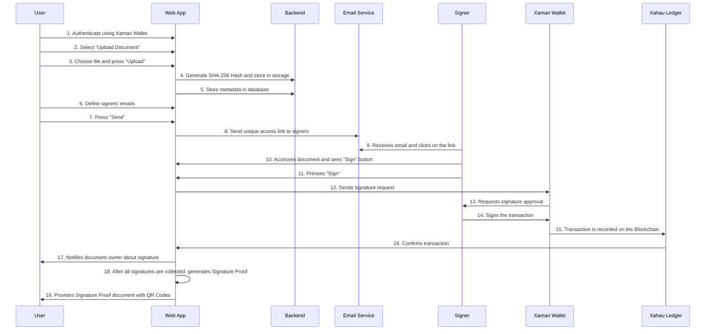

## 1. Introduction

In today’s increasingly digital world, ensuring the authenticity and integrity of documents is more critical than ever. From legal contracts to academic certificates, digital records form the backbone of modern transactions. However, traditional methods of document certification rely on centralized authorities, introducing inherent vulnerabilities such as high costs, fraud risks, and susceptibility to data breaches. As Satoshi Nakamoto noted in the Bitcoin whitepaper [@nakamoto2008], systems dependent on trusted third parties face issues like mediation requirements, increased transaction costs, and the inability to process non-reversible payments.  

Since Bitcoin’s inception and the rise of platforms like Ethereum [@buterin2014], blockchain technology has evolved beyond cryptocurrencies, enabling a broad spectrum of decentralized applications. Ethereum, as described by Buterin, introduced a Turing-complete programming language to facilitate smart contract development. However, Ethereum and similar platforms come with significant limitations, including high transaction costs, scalability challenges, and execution complexity due to their EVM-based architecture.  

To address these challenges, we present Xahau DocProof, a decentralized document verification solution leveraging the Xahau Network's Hook technology. Unlike conventional blockchain-based certification methods, Xahau DocProof utilizes Xahau’s native Hooks to create a more efficient, cost-effective, and scalable platform for document authentication. This approach offers several key advantages:  

- **Direct ledger-level execution**, eliminating the overhead associated with traditional smart contract platforms.  
- **Significantly lower transaction costs** compared to EVM-based solutions.  
- **Enhanced security** through Xahau's restricted execution environment.  

Additionally, the integration of Hooks and WebAssembly (WASM) provides developers with a scalable and cost-effective alternative for implementing on-chain logic while ensuring seamless native ledger integration.  

This paper explores the technical architecture, implementation details, and real-world applications of Xahau DocProof, demonstrating its potential to revolutionize document verification in the digital era. By combining blockchain’s security and immutability with intuitive user interfaces and enterprise-grade functionality, Xahau DocProof delivers a reliable, efficient, and cost-effective solution for document authentication.

## 2. Project Background and Evolution

By 2023, the need for a blockchain-based document verification solution had become increasingly evident. However, existing solutions failed to fully meet the required specifications. Rather than developing a system tightly coupled to a single platform, the objective was to create a decentralized, widely applicable solution that could benefit the entire ecosystem.

At the time, an existing project appeared to be in an advanced development stage. Contributions were made through technical consulting, including product recommendations and Docker integration to enhance the developer experience. These voluntary efforts aimed to strengthen the project's viability.

Later in 2023, personal commitments led to a temporary pause in direct involvement. Upon returning, it became clear that the project had encountered structural and governance-related challenges, preventing it from reaching a production-ready state. Attempts to re-engage highlighted these issues and their impact on progress.

In early 2024, a renewed focus on blockchain interoperability—particularly efforts to connect networks with EVM-compatible sidechains—prompted a strategic shift. This led to an in-depth study of Solidity, OpenZeppelin standards, and ERC-20 mechanisms, culminating in a fully functional proof of concept (PoC). The PoC was presented to key industry participants, sparking discussions on optimization and alternative blockchain architectures better suited for long-term objectives.

Since 2023, significant efforts have been dedicated to this initiative. While the initial focus was on contributing to an existing project, its adoption did not materialize as expected. By 2024, the PoC was successfully implemented on an EVM-compatible chain, and by late 2024 into 2025, efforts shifted toward full integration with next-generation blockchain infrastructure, leveraging smart contracts and wallet-based authentication to enhance security and usability.

## 3. Xahau Hooks: Smart Contracts

DocProof leverages the power of Hooks on Xahau to provide a secure and decentralized document signing system. Hooks are smart contracts that reside directly on the Xahau ledger, allowing for the execution of logic on transactions before they are finalized [@xahau2023]. This functionality is fundamental to DocProof as it ensures that only valid signatures are recorded and that documents cannot be tampered with after signing.

**Hooks offer several advantages over other smart contract solutions:**

*   **Simplicity and Efficiency:** Hooks are lightweight and efficient compared to conventional smart contract solutions.
*   **Native Integration:** Hooks are a layer-one smart contract solution and thus reside natively within the ledger.
*   **Low Fees and Scalability:** Hooks leverage Xahau's low transaction fees and high scalability.
*   **Security and Reliability:** Hooks inherit the robust security and reliability of the XRPL.
*   **Ecosystem Compatibility:** Hooks are designed to be compatible with existing XRPL tools and services.
*   **Account Decentralization:** Using Hooks, it is possible for a Xahau account to be fully autonomous and emit and receive transactions according to the logic of its Hook, instead of relying on external private key holders to manually authorize transactions.

As outlined in the Xahau whitepaper [@xahau2023], Hooks are a smart contract solution developed specifically for the XRPL ecosystem, offering a powerful and efficient way for developers to create decentralized applications and automate transactions. By utilizing Hooks, DocProof can provide a secure, transparent, and reliable document signing system that is built on a solid and proven foundation.

DocProof's use of Hooks allows for the verification of document authenticity, ensuring that it has not been altered. This is because the registration of the document hash is done through a Hook, which imposes rules on transactions. These rules ensure that only valid transactions, i.e., those that correspond to the correct document hash, are accepted.

## 4. Difference Between Xahau Hooks and EVM

Blockchain technology revolutionized decentralized computing by enabling on-chain logic execution through smart contracts. Ethereum pioneered this approach with the Ethereum Virtual Machine (EVM), which allows developers to deploy self-executing contracts written in Solidity or Vyper.  

> *"Ethereum provides a built-in fully fledged Turing-complete programming language that can be used to create 'contracts' that can be used to encode arbitrary state transition functions"* [@buterin2014] 

However, the EVM model has inherent limitations regarding cost, scalability, and complexity. Every transaction must be executed by all nodes, leading to high gas fees and network congestion. Additionally, smart contracts are prone to security vulnerabilities, as seen in past exploits such as The DAO Hack (2016) and the Parity Wallet Bug (2017).  

To address these challenges, Xahau introduces Hooks, a lightweight and event-driven alternative for on-chain programmability that is natively integrated into the XRP Ledger. Unlike Ethereum’s global execution model, where every node processes smart contracts, Hooks operate locally at the account level, reducing costs, execution overhead, and attack surfaces. Additionally, Xahau leverages WebAssembly (WASM) as its execution environment, delivering greater efficiency and flexibility than the EVM.  

**Hooks (Xahau) vs. Smart Contracts (Ethereum)**

| **Feature**           | **Hooks (Xahau)**          | **Smart Contracts (Eth)** |
|:---------------------:|:--------------------------:|:-------------------------:|
| **Execution Model**   | Event-based (account logic)| Global execution (EVM)    |
| **Simplicity**        | High – lightweight & direct| Low – complex & verbose   |
| **Execution Cost**    | Low – No gas fees          | High – Variable gas fees  |
| **Scalability**       | High – Local execution     | Limited – Global execution|
| **Security**          | Inherits XRPL security     | Contract-dependent        |
| **Native Integration**| Yes                        | No – Needs bridges        |
| **Languages**         | Rust, C, C++, JS (soon)    | Solidity, Vyper           |

Hooks function at the account level, meaning they execute logic based on specific events without the need for an external contract deployment. This reduces cost, complexity, and attack vectors compared to Ethereum's smart contracts, which require external execution in the EVM and often depend on bridges or additional mechanisms for interoperability.

### **WASM vs. EVM: Execution Models**

Ethereum’s EVM executes bytecode-based contracts, which are interpreted by every node in the network. This ensures deterministic execution but introduces significant inefficiencies, as every operation must be verified globally, increasing latency and gas costs.

In contrast, Xahau adopts WebAssembly (WASM), a modern execution environment that enables near-native performance and multi-language support.

| **Feature**            | **WASM (Xahau)**       | **EVM (Ethereum)**        |
|:----------------------:|:----------------------:|:-------------------------:|
| **Execution Model**    | Optimized binary       | Bytecode-based VM         |
| **Languages**          | Rust, C, C++, JS (soon)| Solidity, Vyper           |
| **Speed**              | High                   | Medium/Low                |
| **Execution Cost**     | Low                    | High (Gas Fees)           |
| **Security**           | High (Sandboxed)       | Medium (Exploit Risk)     |
| **Efficiency**         | High                   | Low (Nodes execute all)   |

Unlike Solidity, which is Ethereum-specific, WASM allows developers to write Hooks in multiple languages, providing greater flexibility. Additionally, WASM’s execution is sandboxed, reducing common vulnerabilities found in Ethereum contracts, such as reentrancy attacks.

**Why Hooks and WASM Provide a Better Alternative**

*   **Lower Costs:** Hooks eliminate gas fees, making transactions more cost-efficient.
*   **Higher Efficiency:** WASM-based execution ensures faster and more scalable transaction processing.
*   **Native Ledger Interaction:** Hooks interact directly with ledger objects, unlike EVM contracts that rely on intermediaries.
*   **Greater Security:** Hooks inherit XRPL’s robust security model, reducing attack vectors.

While Ethereum pioneered smart contract programmability, its reliance on the EVM, high gas fees, and complexity make it less efficient for certain applications. Xahau’s approach, using Hooks and WASM, introduces a more scalable, cost-effective, and efficient alternative for developers looking to build on-chain logic with lower overhead and native ledger integration.

## 5. Xahau DocProof Functionality

Blockchain technology provides a powerful mechanism for proving the existence and integrity of data. Xahau DocProof leverages this capability by allowing users to submit a cryptographic hash of a document to the blockchain, ensuring that its existence and authenticity can be publicly verified—without exposing the document's content.  

### How It Works

When a document is submitted to Xahau DocProof, we first generate a SHA-256 hash based on the document's content. This hash serves as a unique fingerprint of the document—if any byte is modified, the hash completely changes.  

> *"Once the longest chain has been determined, the proof-of-work ensures that the data could not have been altered without redoing the work."*  
> — **Bitcoin Whitepaper [@nakamoto2008]**  

This principle, foundational to Bitcoin and blockchain security, ensures that once a document’s hash is recorded on the Xahau Ledger, its authenticity remains immutable and verifiable.  

To prevent collisions and ensure document uniqueness, we store not just the hash, but also a unique document identifier (docId).

O diagram below illustrates the complete process flow, from the initial document upload to the collection of all signatures and the generation of the authenticity proof.

### On-Chain Signature Recording in DocProof

Xahau DocProof enables users to record document signatures on the blockchain, ensuring their authenticity and integrity in a transparent and decentralized manner. The process is designed to be accessible to a general audience, without requiring in-depth technical knowledge.

The process of on-chain signature recording involves the following steps:

*   **Document Hash Generation ("Fingerprint")**: Initially, the system creates a unique "fingerprint" of the document, using a process called SHA-256. This "fingerprint" functions as a code that represents the document. Any alteration to the document, even a minimal one, results in a completely different code, ensuring the detection of any modification.
*   **Unique Document Identification**: Additionally, a unique identifier (docId) is assigned to prevent confusion with other documents. This identifier ensures that each document is distinguishable on the blockchain.
*   **Recording on the Xahau Blockchain**: The "fingerprint" and the identifier are then recorded on the Xahau blockchain. The blockchain acts as a public and immutable ledger, where all information is stored securely and transparently.
*   **Unique Key Creation**: To ensure that the signature is unique for each signatory and document, the system combines the signatory's wallet, the document's "fingerprint," and the unique identifier. This combination generates a unique key through a SHA-512half hash. This key is used to store the signature state in the Ledger.
*   **Storage in the Ledger**: The signature is stored in the Xahau Ledger, using hexadecimal encoding to ensure rapid information retrieval.
*   **Signature Verification**: Anyone can verify whether the document has been registered and signed by the competent party by consulting the Xahau blockchain. This process guarantees the authenticity and integrity of the document in a transparent and decentralized manner.

To conclude, on-chain signature recording in DocProof involves creating a document "fingerprint," combining this "fingerprint" with a unique identifier and the signatory's wallet to generate a unique key, and recording this key on the Xahau blockchain. This process ensures the document's authenticity and integrity transparently and decentrally.

With this method, DocProof ensures a secure and verifiable record of document signatures on the Xahau blockchain.

### Storage and Fees

The usage fee for Xahau DocProof is **1 XAH**. Currently, the storage fee for maintaining the state on the Xahau Ledger is **0.2 XAH**. The Hook is designed to retain only the necessary amount to cover operational costs, while the residual balance is transferred to a secondary wallet that manages the service's operation.

Additionally, the Hook has been developed to allow fee adjustments over time in case of an increase in the value of the XAH token. This adjustment can be made without modifying the source code or requiring a new Hook update, ensuring flexibility and long-term sustainability.

### Key Features

- **Proof of Existence Registration**: Generation of a unique document hash and secure storage on the blockchain.
- **Authenticity Verification**: Any user can verify whether a document has been registered and signed by the competent party.
- **Ease of Integration**: Although the API is not yet publicly available, the project has been designed to offer a simple and intuitive solution based on the Xahau network for smart signatures.

With Xahau DocProof, we provide a secure, transparent, and reliable way to register and verify documents on the blockchain, reducing fraud and increasing the trustworthiness of digital records.

\newpage

## Conclusion

Xahau DocProof represents a significant advancement in decentralized document authentication. By leveraging the Xahau Network’s Hook technology, the platform eliminates the reliance on centralized certification authorities, offering a more secure, cost-effective, and tamper-proof solution for verifying document authenticity.

The integration of cryptographic hashing ensures that documents remain private while still benefiting from immutable, verifiable records on the blockchain. Unlike traditional smart contract-based solutions, the use of Hooks allows for more efficient execution, lower transaction costs, and enhanced security, making Xahau DocProof an ideal choice for enterprises and individuals alike.

Additionally, by integrating with the Xaman Wallet, Xahau DocProof simplifies the user experience, enabling seamless authentication and verification without compromising security. This design choice not only enhances accessibility but also aligns with the broader goal of increasing blockchain adoption in real-world applications.

As blockchain adoption continues to grow, the demand for decentralized, trustless verification mechanisms becomes more pressing. Xahau DocProof effectively meets this need, offering a scalable and robust solution that guarantees the integrity and authenticity of digital documents, all without relying on intermediaries. This approach echoes the vision outlined in Satoshi Nakamoto’s seminal Bitcoin whitepaper, which emphasizes the importance of decentralized systems that operate without the need for trusted third parties. Just as Bitcoin eliminates the need for banks to validate transactions, Xahau DocProof removes the need for central authorities in document authentication.

Future developments may include API expansion and enhanced enterprise features, further solidifying its role as a leading platform for document verification. By bridging the gap between blockchain security and usability, Xahau DocProof sets a new standard, paving the way for a more transparent and decentralized future in document authentication.

\newpage

## References

